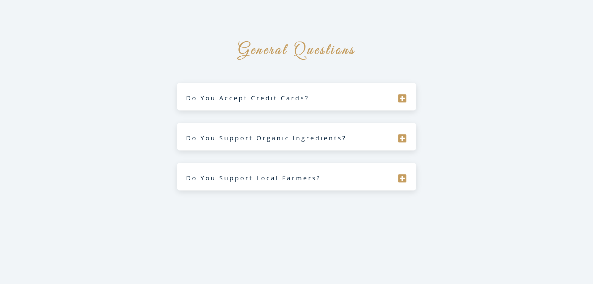

<h1 align="center">Accordion Questions</h1>

It is a JS mini project for practice.

### I learned

In this mini project I've learnt about <b>currentTarget</b> and the difference between it and <b>target</b> .

### Built With

built with html, css, pure js.
